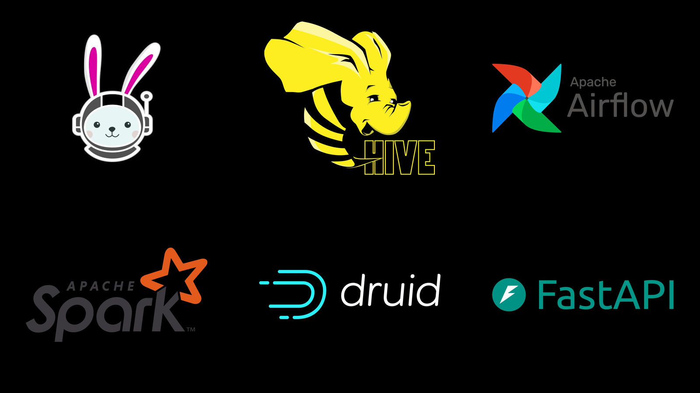
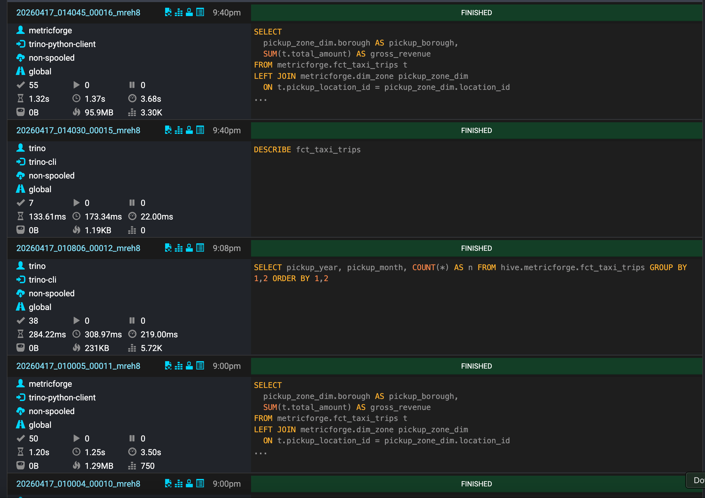
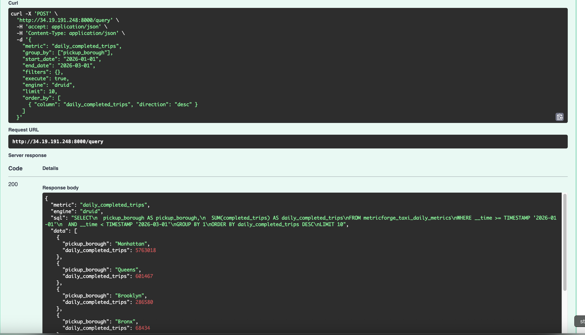

# MetricForge NYC

MetricForge NYC est un projet open source de portfolio inspiré de **Minerva**, la plateforme de métriques et de semantic layer d'Airbnb.

L'objectif : centraliser les métriques business dans une couche sémantique déclarative (YAML) pour éviter que chaque équipe recalcule les mêmes KPI différemment avec des SQL, filtres et conventions divergents. Une seule définition, plusieurs moteurs d'exécution, un seul chiffre par question.

## Architecture



```text
NYC Taxi Data (TLC)
  -> MinIO raw bucket
  -> Airflow
  -> Spark (ingestion + certification + agrégats Druid)
  -> Hive Metastore
  -> MinIO warehouse bucket (Parquet)
  -> Trino (SQL flexible)  +  Druid (OLAP pré-agrégé)
  -> Semantic Layer YAML (metrics_engine)
  -> FastAPI  (/query, /metrics, /dimensions, /validate)
  -> Streamlit + Plotly (dashboard)
```

Le projet montre :

- **MinIO** pour le stockage objet local compatible S3
- **Apache Spark** pour l'ingestion, les tables certifiées et les agrégats Druid
- **Hive Metastore** pour le catalogue technique partagé Spark/Trino
- **Trino** pour le serving SQL flexible
- **Apache Druid** pour le serving OLAP pré-agrégé (datasources `metricforge_taxi_daily_metrics` et `metricforge_taxi_zone_metrics`)
- **Apache Airflow** pour l'orchestration complète du pipeline
- **Semantic layer YAML** (`metrics_engine`) pour définir dimensions, joins et métriques
- **FastAPI** pour exposer les requêtes de métriques avec `limit` et `order_by`
- **Streamlit + Plotly** pour la démo produit (thème dark, charts auto-sélectionnés)

La couche sémantique expose aujourd'hui **10 métriques** (`completed_trips`, `gross_revenue`, `average_fare`, `average_tip`, `total_tip_amount`, `tip_rate`, `average_trip_distance`, `average_trip_duration`, `daily_zone_revenue`, `daily_completed_trips`) sur **8 dimensions** (`pickup_zone`, `pickup_borough`, `dropoff_zone`, `dropoff_borough`, `payment_type`, `pickup_date`, `pickup_month`, `pickup_day`).

## Aperçu visuel

### Stockage et catalogue


### Orchestration Airflow


### Serving SQL Trino



### Serving OLAP Druid


### API FastAPI (semantic layer)


### Dashboard Streamlit



### Infrastructure


## Modes d'exécution

### 1. Local lightweight (sans Docker)

Mode dev pour le parser, le validator, les tests, l'API et le dashboard :

```bash
python3 -m venv .venv
source .venv/bin/activate
pip install -r requirements.txt

python -m pytest -q
uvicorn api.main:app --reload
streamlit run dashboard/app.py
```

### 2. Serving stack (MinIO + Hive + Trino)

```bash
docker compose \
  -f docker/compose.base.yml \
  -f docker/compose.minio.yml \
  -f docker/compose.hive.yml \
  -f docker/compose.trino.yml \
  up -d
```

### 3. Full demo stack (recommandé)

Mode démo portfolio, tous les services en une commande (MinIO + Hive + Trino + Druid + Airflow + FastAPI + Streamlit) :

```bash
bash scripts/run_demo_stack.sh
# ou
docker compose -f docker/compose.demo.yml up -d --build
```

Arrêt propre :

```bash
bash scripts/stop_demo_stack.sh
```

### 4. Stacks ciblées

Airflow seul avec ses dépendances :

```bash
bash scripts/run_airflow_stack.sh
```

Druid seul avec ses dépendances :

```bash
bash scripts/run_druid_stack.sh
```

## Pipelines Spark

Les jobs Spark se trouvent dans `spark/` :

- `01_create_hive_database.py` — crée la base `metricforge` dans le Hive Metastore
- `02_ingest_raw_taxi_data.py` — charge les CSV NYC TLC depuis MinIO en tables raw
- `03_build_certified_tables.py` — construit les tables certifiées partitionnées (`fct_taxi_trips`, `dim_zone`, `dim_payment_type`, `dim_date`)
- `04_build_druid_aggregates.py` — calcule les rollups journaliers/par zone et publie les JSON ingérés par Druid
- `04_run_sample_queries.py` — requêtes d'exemple de validation

Exécution locale (après avoir poussé les données) :

```bash
python scripts/load_nyc_taxi_to_minio.py
python spark/01_create_hive_database.py
python spark/02_ingest_raw_taxi_data.py
python spark/03_build_certified_tables.py
python spark/04_build_druid_aggregates.py
```

Dans la stack complète, Airflow orchestre ces étapes, y compris le téléchargement `TLC -> MinIO raw`. La liste des mois à ingérer est dynamique via la variable `TLC_TRIPDATA_MONTHS` (défaut : `2026-01,2026-02`). `taxi_zone_lookup.csv` est toujours chargé.

## DAGs Airflow

Dans `airflow/dags/` :

- `ingest_nyc_taxi_data.py` — TLC → MinIO raw
- `build_certified_tables.py` — Spark : raw → curated → certified
- `build_druid_aggregates.py` — Spark : certified → agrégats JSON Druid
- `refresh_druid_datasources.py` — soumet les specs à l'Overlord Druid
- `refresh_metric_catalog.py` — régénère le catalogue des métriques exposé par l'API
- `validate_semantic_layer.py` — lint/validation du semantic layer
- `metricforge_full_pipeline.py` — DAG parent qui déclenche toute la chaîne

## Tests

Dans `tests/` :

```bash
python -m pytest tests/test_semantic_yaml.py
python -m pytest tests/test_sql_generator.py
python -m pytest tests/test_sql_generator_druid.py
python -m pytest tests/test_routing.py
python -m pytest tests/test_api_engine_routing.py
python -m pytest tests/test_trino_executor.py
python -m pytest tests/test_druid_executor.py
python -m pytest tests/test_source_loader.py
python -m pytest tests/test_spark_session.py
# ou simplement:
python -m pytest -q
```

## Endpoints API

- `GET /health`
- `GET /engines`
- `GET /engines/trino/health`
- `GET /engines/druid/health`
- `GET /metrics`
- `GET /dimensions`
- `POST /validate`
- `POST /query` — supporte `metric`, `group_by`, `time_grain`, `start_date`, `end_date`, `filters`, `engine`, `execute`, ainsi que **`limit` (1-10000)** et **`order_by` (liste de `{column, direction}`)**

Doc interactive : `http://localhost:8000/docs`.

## Exemples curl

Health :

```bash
curl http://localhost:8000/health
```

Catalogue des métriques :

```bash
curl http://localhost:8000/metrics
```

SQL Trino sans exécution (révision de la requête générée) :

```bash
curl -X POST http://localhost:8000/query \
  -H "Content-Type: application/json" \
  -d '{
    "metric": "gross_revenue",
    "group_by": ["pickup_borough"],
    "start_date": "2026-01-01",
    "end_date": "2026-03-01",
    "engine": "trino",
    "execute": false
  }'
```

Top 10 zones par chiffre d'affaires (Druid, pré-agrégé, ~200 ms) :

```bash
curl -X POST http://localhost:8000/query \
  -H "Content-Type: application/json" \
  -d '{
    "metric": "daily_zone_revenue",
    "group_by": ["pickup_zone"],
    "start_date": "2026-01-01",
    "end_date": "2026-03-01",
    "engine": "druid",
    "limit": 10,
    "order_by": [{"column": "daily_zone_revenue", "direction": "desc"}]
  }'
```

Série temporelle (Trino + `time_grain`) :

```bash
curl -X POST http://localhost:8000/query \
  -H "Content-Type: application/json" \
  -d '{
    "metric": "completed_trips",
    "time_grain": "day",
    "start_date": "2026-01-01",
    "end_date": "2026-03-01",
    "engine": "trino"
  }'
```

## Services utiles

- MinIO console : http://localhost:9001
- Trino UI : http://localhost:8080
- Druid router : http://localhost:8888
- Airflow UI : http://localhost:8081
- FastAPI docs : http://localhost:8000/docs
- Streamlit dashboard : http://localhost:8501

## Structure du repo

```
metrics_engine/      # parser/validator/SQL generator, executors Spark/Trino/Druid
semantic_layer/      # metrics.yml, dimensions.yml, joins.yml, entities.yml
api/                 # FastAPI (main.py)
dashboard/           # Streamlit + Plotly (app.py)
spark/               # jobs Spark (ingestion, certification, agrégats Druid)
airflow/             # dags/ + include/
docker/              # compose.*.yml + images custom (airflow, apps, druid, hive, trino)
scripts/             # run_demo_stack.sh, stop_demo_stack.sh, run_airflow_stack.sh, run_druid_stack.sh, ...
tests/               # pytest (semantic_yaml, sql_generator, sql_generator_druid, routing, executors, ...)
docs/                # documentation détaillée
infra/               # Terraform GCP VM
data/                # raw/, curated/ (git-ignored)
img/                 # screenshots README + article Medium
```

## Limitations connues

- la stack complète est lourde et vise surtout une **VM GCP 32 Go** (type `e2-standard-8`)
- Hive Metastore + MinIO + S3A peut demander des ajustements de jars selon l'image et l'environnement (entrypoint fourni)
- Druid tourne en topologie multi-services de démo (Coordinator, Broker, Historical, MiddleManager, Router), ce qui reste lourd à démarrer
- les specs Druid supposent un export agrégé préalable par Spark
- les credentials fournis sont strictement **dev-only**

## Prochaines améliorations possibles

- observabilité bout-en-bout (Prometheus/Grafana sur la stack)
- tests d'intégration automatisés contre la full stack
- plus de métriques ratio/cohort et de filtres utilisateur
- export automatique des agrégats Druid depuis Spark ou Trino sans étape intermédiaire

## Documentation complémentaire

- [docs/architecture.md](./docs/architecture.md)
- [docs/business_requirements.md](./docs/business_requirements.md)
- [docs/metric_lifecycle.md](./docs/metric_lifecycle.md)
- [docs/demo_runbook.md](./docs/demo_runbook.md)
- [docs/airflow_orchestration.md](./docs/airflow_orchestration.md)
- [docs/druid_serving_layer.md](./docs/druid_serving_layer.md)
- [docs/local_vs_gcp_vm.md](./docs/local_vs_gcp_vm.md)
- [docs/gcp_vm_setup.md](./docs/gcp_vm_setup.md)
- [docs/minerva_mapping.md](./docs/minerva_mapping.md)
